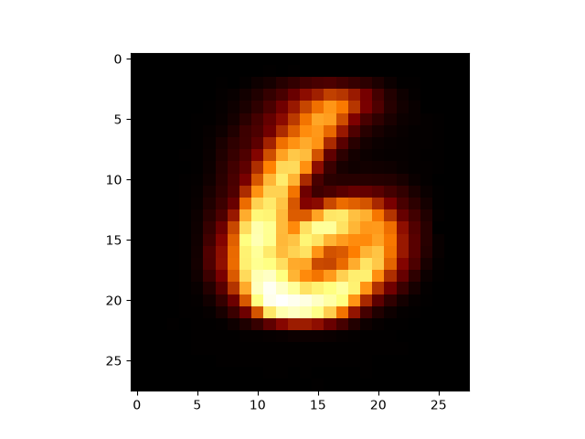
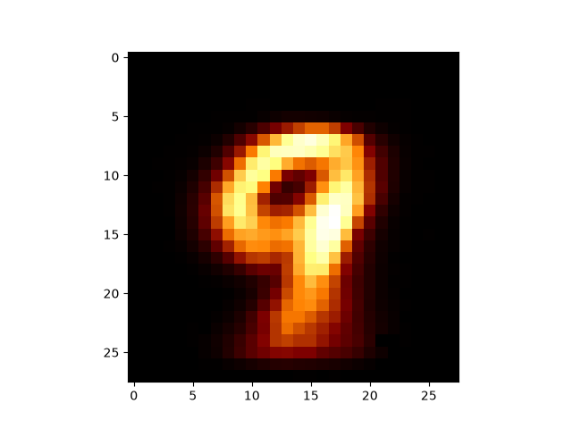

# NNFS Extreme

> NNFS from scratch. Actually.

This is an educational project (MVP completed) aimed at building a neural network starting by literally writing the dot product function :)
and building my way from the bottom up towards a performant NN that can classify MNIST digit pictures. However, this engine can generally work on for any dataset with some light tweaking.

This project is heavily inspired by [Michael Nielsen](https://michaelnielsen.org/)'s [book on Neural Networks and Deep Learning](http://neuralnetworksanddeeplearning.com/) ,
as I have not only used this book to learn about deep learning, but also translated its implementation to blazing fast C++. As this is the 
first time I was learning about neural networks, I am perfectly happy with this approach.

After successfully achieving 95% accuracy in digit classification, as an experiment, I swapped the input and outputs of the training data and got the network to output some really nice images ([visualized using Python](scripts/pixelarray_to_image.py)) of digits!

<table width="100%">
  <tr>
    <td align="center" width="50%">
      
    </td>
    <td align="center" width="50%">
      
    </td>
  </tr>
  <tr>
    <td align="center">
      <b>Definitely not an upside down 9</b>
    </td>
    <td align="center">
      <b>Definitely a 9</b>
    </td>
  </tr>
</table>

The foundational math libary used for 
this project was my very own linear algebra library Spalten, built for the very purpose of using it to write neural networks. The main offering
of that library is the Matrix class template, that is optimised and accelerated for great (i hope) performance using fast algorithms and advanced 
C++ features. Check the library (still WIP) out [here](https://github.com/atharvesting/spalten-linalg-library).

I plan to write about this project in my blog which you can find on [Medium](https://atharvesting.medium.com/) or [Substack](https://atharvesting.substack.com/).

The pickled and zipped data can be found inside Nielsen's own [repository](https://github.com/mnielsen/neural-networks-and-deep-learning/blob/master/data/mnist.pkl.gz).

---

The project is part of a mult-layered and multi-faceted progression, which was conceptualized by me to take a journey through low-level C++, 
ML mathematics, Concurrency, Computer Vision, all the way to resource-efficient-aggresive TinyML.

- [x] Phase 1: Spalten (Foundational Linear Algebra Library)
- [x] Phase 2: NNFS-Extreme (Neural Network trained on the MNIST dataset) -> Built on top of Spalten
- [ ] Phase 3: MNIST-CV (CV layer that classifies digits drawn using gestures) -> NNFS-E as the engine
- [ ] Phase 4: ESP32-MNIST (The entire pipeline running on an ESP32-S3 Sense) -> Using all of the above

More about this to be documented soon!

---

I would like to be absolutely transparent with the fact that I used AI tools for debugging and helping me understand how Python translates 
optimally to C++. I also used it to build the scripts that extracted the zipped MNIST data and prepare it to be used by the NN. However, I 
made sure to understand each line of code and comment it throughout to document my understanding. I regularly post blogs and to put this 
understanding into my own words for everyone.