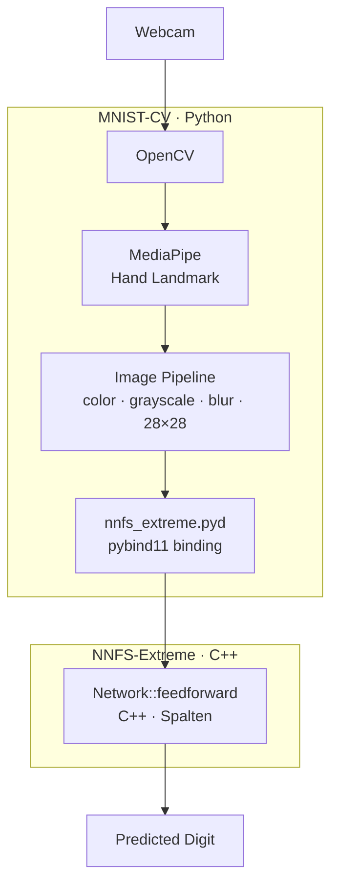
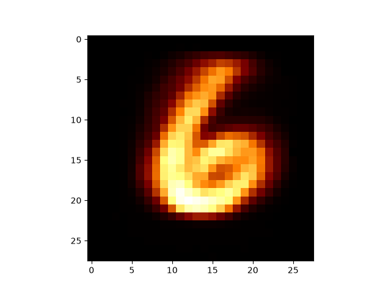
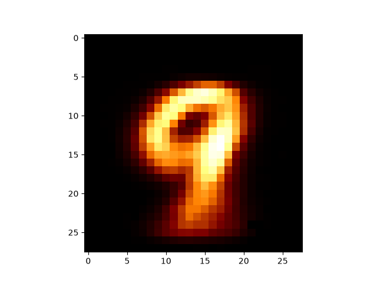
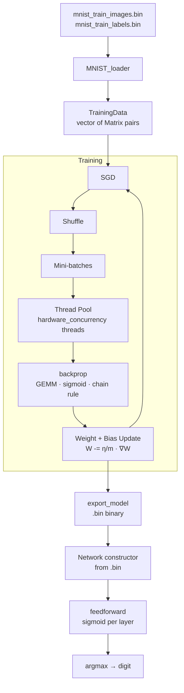
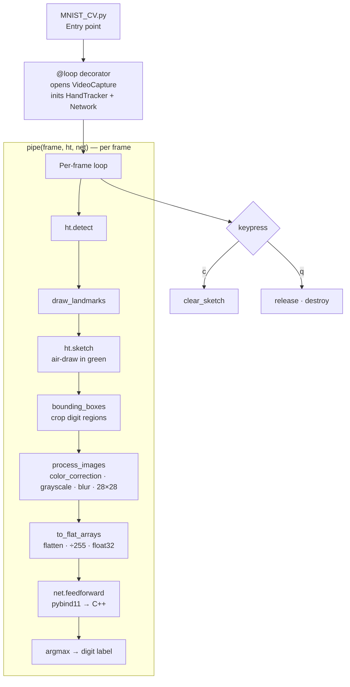

# NNFS Extreme · MNIST CV

The project-group is part of a mult-layered and multi-faceted progression, which was conceptualized by me to take a journey through low-level C++, ML mathematics, Concurrency, Computer Vision, all the way to resource-efficient-aggresive TinyML.

- [x] Phase 1: [Spalten](https://github.com/atharvesting/spalten-linalg-library) (Foundational Linear Algebra Library)
- [x] Phase 2: [NNFS-Extreme](#nnfs-extreme) (Neural Network trained on the MNIST dataset) -> Built on top of Spalten
- [x] Phase 3: [MNIST-CV](#mnist-cv) (CV layer that classifies digits drawn using gestures) -> NNFS-E as the engine
- [ ] Phase 4: ESP32-MNIST (The entire pipeline running on an ESP32-S3 Sense) -> Using all of the above

---

## Overall Architecture


```mermaid
graph TD
    CAM[Webcam] --> CV[OpenCV]
    CV --> MP[MediaPipe\nHand Landmark]
    MP --> PIPE[Image Pipeline\ncolor · grayscale · blur · 28×28]
    PIPE --> PYD[nnfs_extreme.pyd\npybind11 binding]
    PYD --> NET[Network::feedforward\nC++ · Spalten]
    NET --> OUT[Predicted Digit]

    subgraph MNIST_CV [MNIST-CV · Python]
        CV
        MP
        PIPE
        PYD
    end

    subgraph NNFS_E [NNFS-Extreme · C++]
        NET
    end
```

---

## Project Directory

```
NNFS_Extreme/
├── NNFS_Extreme/      
│   ├── CMakeLists.txt            # Build instructions for NNFS_Extreme       
│   ├── NN.hpp / NN.cpp           # Neural Network Implementation from Scratch
│   ├── activation_functions.*    # Set of all common activation functions and their derivatives
│   ├── data_loaders.*            # Functions essential for loading training and testing binaries
│   ├── utils.*                   # Extra utilities like the `ThreadPool` class
│   ├── python_bindings.cpp       # Python bindings (pybind11) to access NN through Python
│   ├── NNFS_Extreme.cpp          # Main entry point of the standalone NNFS-Extreme Project
│   └── examples/                 # Ready-to-use functions for the standalone NNFS-Extreme Project
├── MNIST_CV/                     
│   ├── MNIST_CV.py               # Main entry point of the MNIST-CV Project
│   ├── looping.py                # Video Camera Loop Decorator + Main body function
│   ├── hand_tracking.py          # HandTracker class for landmarking, bounding boxes and drawing
│   ├── image.py                  # Image processing functions and pipeline
│   ├── nnfs_extreme.pyd          # pybind11-generated bindings to run NNFS_Extreme code
│   └── nnfs_extreme.pyi          # Typing stubs for Network Class.
├── third_party/                  
│   └── Spalten/                  # Git submodule for the underlying foundational matrix engine
├── data/                         # Artifacts and program outputs including model binaries
├── assets/                       # Media for README.md
├── scripts/                      # Miscellaneous scripts
└── CMakeLists.txt                # Main build instructions
```

---


## NNFS-Extreme
> NNFS from scratch. Actually.

This is an educational project (MVP completed) aimed at building a neural network by literally starting with the dot product function :)
and building my way from the bottom up towards a performant NN that can classify MNIST digit pictures. However, this engine can generally work on for any dataset with some light tweaking.

This project is heavily inspired by [Michael Nielsen](https://michaelnielsen.org/)'s [book on Neural Networks and Deep Learning](http://neuralnetworksanddeeplearning.com/) ,
as I have not only used this book to learn about deep learning, but also translated its implementation to blazing fast C++. As this is the 
first time I was learning about neural networks, I am perfectly happy with this approach. If you feel curious about my journey of 
improving training speed and inference, see the notes I kept on performance (I started tracking this too late `sad_emoji`).

After successfully achieving 95% accuracy in digit classification, as an experiment, I swapped the input and outputs of the training data and got the network (with only 1 hidden layer containing 30 neurons!) to output some really nice images ([visualized using Python](scripts/pixelarray_to_image.py)) of digits!

<table width="100%">
  <tr>
    <td align="center" width="50%">
      
    </td>
    <td align="center" width="50%">
      
    </td>
  </tr>
  <tr>
    <td align="center">
      <b>Definitely not an upside down 9</b>
    </td>
    <td align="center">
      <b>Definitely a 9</b>
    </td>
  </tr>
</table>

---
### Architecture
---


```mermaid
graph TD
    BIN[mnist_train_images.bin\nmnist_train_labels.bin] --> DL[MNIST_loader]
    DL --> TD[TrainingData\nvector of Matrix pairs]
    TD --> SGD[SGD]

    subgraph Training
        SGD --> SHUF[Shuffle]
        SHUF --> MB[Mini-batches]
        MB --> TP[Thread Pool\nhardware_concurrency threads]
        TP --> BP[backprop\nGEMM · sigmoid · chain rule]
        BP --> UPD[Weight + Bias Update\nW -= η/m · ∇W]
        UPD --> SGD
    end

    UPD --> EXP[export_model\n.bin binary]
    EXP --> IMP[Network constructor\nfrom .bin]
    IMP --> FF[feedforward\nsigmoid per layer]
    FF --> PRED[argmax → digit]
```

**Key implementation details:**
- Weights: `vector<Matrix<float>>` — shape `[neurons_out × neurons_in]` per layer
- Biases: `vector<Matrix<float>>` — shape `[neurons × 1]` per layer
- Mini-batch stacked as columns: `X [784 × m]`, `Y [10 × m]` for GEMM efficiency
- Activation: sigmoid everywhere, cost derivative: `output − actual`
- Thread pool parallelises backprop across sub-ranges of each mini-batch, accumulating `∇W` and `∇b` under a mutex
- Model binary format: `num_layers → sizes[] → weights (rows·cols·data) → biases (rows·cols·data)`

### Standard Example
```cpp
int main() 
{
  int epochs = 20, mini_batch_size = 32;
  float learning_rate = 2.0F;

	auto training_data = MNIST_loader::load_training_data("data/mnist_train_images.bin", "data/mnist_train_labels.bin", 50000,  false);	// inverted_data = false
	
	auto test_data = MNIST_loader::load_test_data("data/mnist_test_images.bin", "data/mnist_test_labels.bin", 10000);

	auto nn = Network(std::vector<int>{ 784, 30, 10 });

	nn.SGD(training_data, epochs, mini_batch_size, learning_rate, test_data);
}
```

### Spalten: Backbone of the Neural Network

The foundational math libary used for this project was my very own linear algebra library Spalten, built for the very purpose of using it to write neural networks. The main offering of that library is the Matrix class template, that is optimised and accelerated for great (i hope) performance using fast algorithms and advanced C++ features. Check the library (still WIP) out [here](https://github.com/atharvesting/spalten-linalg-library). Spalten and NNFS-Extreme are written with zero external dependencies.

The pickled and zipped data can be found inside Nielsen's own [repository](https://github.com/mnielsen/neural-networks-and-deep-learning/blob/master/data/mnist.pkl.gz).

---

## MNIST-CV

This project puts the above Neural Network to test by making it classify digits from a stream of real time images. The images are sourced from a live camera feed that uses OpenCV and MediaPipe to track hand landmarks and draw the digits on an air canvas. The feed must be dealt with such that the individual digit drawings are detected, processed (this word is doing some heavy lifting) and sent to the network for classification. The primary language used is Python. Python bindings (pybind11) is used to transmit data image array data, run inference, and send the classification output back to the Python program.

The idea for this project stemmed from my interest in Computer Vision as well as the desire to build upon the neural network in a way that expanded my technological know-how further.

### Architecture
---


```mermaid
graph TD
    EP[MNIST_CV.py\nEntry point] --> DEC["@loop decorator\nopens VideoCapture\ninits HandTracker + Network"]
    DEC --> LOOP[Per-frame loop]

    subgraph pipe ["pipe(frame, ht, net) — per frame"]
        LOOP --> DET[ht.detect]
        DET --> LM[draw_landmarks]
        LM --> SKT[ht.sketch\nair-draw in green]
        SKT --> BOX[bounding_boxes\ncrop digit regions]
        BOX --> PROC[process_images\ncolor_correction · grayscale · blur · 28×28]
        PROC --> FLAT[to_flat_arrays\nflatten · ÷255 · float32]
        FLAT --> FF[net.feedforward\npybind11 → C++]
        FF --> PRED[argmax → digit label]
    end

    LOOP --> KEY{keypress}
    KEY -- c --> CLR[clear_sketch]
    KEY -- q --> END[release · destroy]
```

**Module responsibilities:**

| File | Role |
|---|---|
| `MNIST_CV.py` | Entry point — calls `pipe()` |
| `looping.py` | `@loop` decorator (webcam lifecycle) + `pipe` (per-frame logic) |
| `hand_tracking.py` | MediaPipe landmark detection, air-canvas sketch, bounding box extraction |
| `image.py` | MNIST-compatible image processing pipeline |
| `nnfs_extreme.pyd` | pybind11 C++ extension — exposes `Network(model_path)` and `feedforward(array)` |

---
## ESP32-MNIST

The final phase of this progression takes things towards aggressive optimisation and TinyML. The goal for this phase is to run the entire
data streaming and inference pipeline -- Live video stream -> Drawing Digits -> Real-time classification -- on the ESP32-S3 Sense Board, 
which features 8MB PSRAM and 8MB Flash.

Apart from the obvious challenges, a major obstacle to be dealt with will be running the hand landmarking model (sourced from Google's
Mediapipe Docs) on the microcontroller, since the model file already occupies over 8MB of space.

---

I plan to write about this project in my blog which you can find on [Medium](https://atharvesting.medium.com/) or [Substack](https://atharvesting.substack.com/).


### References

- [MediaPipe Hand Landmarker Python Docs](https://developers.google.com/edge/mediapipe/solutions/vision/hand_landmarker/python)
- [Hand Landmarker Example Notebook](https://colab.research.google.com/github/googlesamples/mediapipe/blob/main/examples/hand_landmarker/python/hand_landmarker.ipynb)
- [C++ Thread Pool Implementation](https://stackoverflow.com/a/32593825)
- [Cropping an Image](https://learnopencv.com/cropping-an-image-using-opencv/)
- [Replacing elements in NumPy](https://stackoverflow.com/questions/19666626/replace-all-elements-of-numpy-array-that-are-greater-than-some-value)
- [Pixelating an Image using OpenCV](https://stackoverflow.com/questions/55508615/how-to-pixelate-image-using-opencv-in-python)
- [Blurring an Image using OpenCV](https://docs.opencv.org/5.0/py_tutorials/py_imgproc/py_filtering/py_filtering.html)
- [Time Python Module docs](https://docs.python.org/3/library/time.html)
- [Primer on Python Decorators](https://realpython.com/primer-on-python-decorators/)
- [HandLandmarkerResult Docs](https://ai.google.dev/edge/api/mediapipe/python/mp/tasks/vision/HandLandmarkerResult)
- [Size of numeric datatypes in C](https://stackoverflow.com/questions/589575/what-does-the-c-standard-say-about-the-size-of-int-long)
- [ESP32 CAM Setup Guide](https://randomnerdtutorials.com/esp32-cam-ov2640-camera-settings)
- [OpenCV VideoCapture Set Enum Info](https://docs.opencv.org/3.4.20/dc/d3d/videoio_8hpp.html)

---
### AI use disclosure

I would like to be absolutely transparent with the fact that I used AI tools for debugging, helping me understand how Python translates 
optimally to C++, and constructing build instructions. I also used it to build the scripts that extracted the zipped MNIST data and prepare it to be used by the NN. However, I 
made sure to understand each line of code and comment it throughout to document my understanding. I regularly post blogs and to put this 
understanding into my own words for everyone.

---

- Started: 2026-07-29
- Languages: C++, Python
